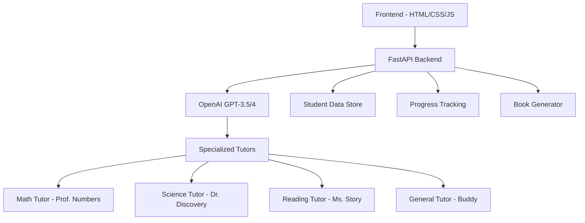

# 🎓 Peregrine AI Tutor Platform

> **Personalized AI-powered education platform that adapts to each student's interests and learning style**


## 🌟 Features

### 🤖 AI-Powered Tutoring
- **Specialized AI Tutors**: Math, Science, Reading, and General learning companions
- **Personalized Learning**: Adapts to student's grade level, interests, and learning style
- **Conversation Memory**: AI remembers previous discussions for contextual learning

### 📚 Content Generation
- **Custom Story Generator**: Creates personalized books and chapters based on student interests
- **Interactive Reading**: Text-to-speech functionality for generated content
- **Adaptive Difficulty**: Content automatically adjusts to student's grade level

### 🎤 Voice Integration
- **Speech-to-Text**: Students can speak their questions naturally
- **Text-to-Speech**: AI responses and stories read aloud
- **Hands-free Learning**: Complete voice interaction support

### 📊 Progress Tracking
- **Real-time Analytics**: Track learning progress and topic mastery
- **Parent Dashboard**: Comprehensive insights for parents and educators
- **Achievement System**: Gamified learning with badges and streaks

## 🚀 Quick Start

### Prerequisites
- Python 3.8+
- OpenAI API Key
- Modern web browser with microphone support

### Installation

1. **Clone the repository**
   ```bash
   git clone https://github.com/yourusername/peregrine-ai-tutor.git
   cd peregrine-ai-tutor
   ```

2. **Backend Setup**
   ```bash
   cd backend
   python -m venv venv
   source venv/bin/activate  # On Windows: venv\Scripts\activate
   pip install -r requirements.txt
   ```

3. **Environment Configuration**
   ```bash
   cp .env.example .env
   # Edit .env and add your OpenAI API key:
   # OPENAI_API_KEY=your_api_key_here
   ```

4. **Run the Backend**
   ```bash
   python main.py
   ```

5. **Open Frontend**
   ```bash
   cd ../frontend
   # Open index.html in your browser or serve with a local server
   python -m http.server 3000
   ```

## 🏗️ Architecture



## 📡 API Endpoints

### Student Management
- `POST /api/students` - Create student profile
- `GET /api/students/{student_id}` - Get student details
- `GET /api/students/{student_id}/progress` - Get learning progress

### Chat & Tutoring
- `POST /api/chat` - Send message to AI tutor
- `GET /api/students/{student_id}/conversations` - Get chat history

### Content Generation
- `POST /api/generate-chapter` - Generate custom story chapter
- `GET /api/students/{student_id}/books` - Get generated books

### Analytics
- `GET /api/parent/dashboard/{student_id}` - Parent dashboard data

## 🎯 Core Components

### AI Tutors
Each specialized tutor has unique personality and teaching approach:

- **🤖 Buddy** - General learning companion, adapts to any subject
- **🔢 Professor Numbers** - Math specialist, makes math fun with real-world examples
- **🔬 Dr. Discovery** - Science expert, encourages experimentation and curiosity
- **📚 Ms. Story** - Reading & writing tutor, focuses on creativity and comprehension

### Personalization Engine
- **Interest-Based Learning**: Incorporates dinosaurs, space, animals, etc. into lessons
- **Learning Style Adaptation**: Visual, auditory, kinesthetic, reading/writing
- **Grade-Level Optimization**: Automatically adjusts complexity and vocabulary

## 🛠️ Development

### Tech Stack
- **Backend**: FastAPI, Python 3.8+, OpenAI API
- **Frontend**: Vanilla HTML/CSS/JavaScript, Web Speech API
- **AI**: OpenAI GPT-3.5-turbo/GPT-4
- **Voice**: Web Speech API (Speech Recognition & Synthesis)

### Contributing
1. Fork the repository
2. Create a feature branch (`git checkout -b feature/amazing-feature`)
3. Commit your changes (`git commit -m 'Add amazing feature'`)
4. Push to the branch (`git push origin feature/amazing-feature`)
5. Open a Pull Request

### Development Setup with GitHub Copilot
1. Install GitHub Copilot extension in VS Code
2. Open project in VS Code
3. Copilot will provide intelligent code suggestions based on context
4. Use comments to guide Copilot: `# Create a function to validate student input`

## 🧪 Testing

```bash
# Run backend tests
cd backend
python -m pytest tests/

# Test API endpoints
curl -X POST http://localhost:8000/api/students \
  -H "Content-Type: application/json" \
  -d '{"id":"test123","name":"Test Student","grade_level":5,"interests":["science"],"learning_style":"visual"}'
```

## 📱 Deployment

### Docker
```bash
docker-compose up -d
```

### Manual Deployment
1. Set up Python environment on server
2. Install dependencies
3. Configure environment variables
4. Run with Gunicorn: `gunicorn main:app --host 0.0.0.0 --port 8000`

## 🔐 Security Notes

- Never commit API keys to the repository
- Use environment variables for sensitive configuration
- Implement rate limiting for production
- Add proper authentication for multi-user scenarios

## 📈 Roadmap

- [ ] **Database Integration** - PostgreSQL/MongoDB for persistent storage
- [ ] **User Authentication** - Multi-student and parent accounts
- [ ] **Mobile App** - React Native or Flutter implementation
- [ ] **Advanced Analytics** - Detailed learning insights and recommendations
- [ ] **Curriculum Integration** - Alignment with educational standards
- [ ] **Multiplayer Learning** - Collaborative features and peer interaction
- [ ] **Voice Cloning** - Personalized tutor voices
- [ ] **AR/VR Integration** - Immersive learning experiences

## 🤝 Contributing

We welcome contributions! Please see our [Contributing Guide](CONTRIBUTING.md) for details.

## 📄 License

This project is licensed under the MIT License - see the [LICENSE](LICENSE) file for details.

## 🙏 Acknowledgments

- OpenAI for providing the AI models
- FastAPI community for the excellent framework
- Web Speech API for voice capabilities
- All contributors and educators who provide feedback

## 📞 Support

- **Issues**: [GitHub Issues](https://github.com/yourusername/peregrine-ai-tutor/issues)
- **Discussions**: [GitHub Discussions](https://github.com/yourusername/peregrine-ai-tutor/discussions)
- **Email**: your-email@example.com

---

**Made with ❤️ for students everywhere**
